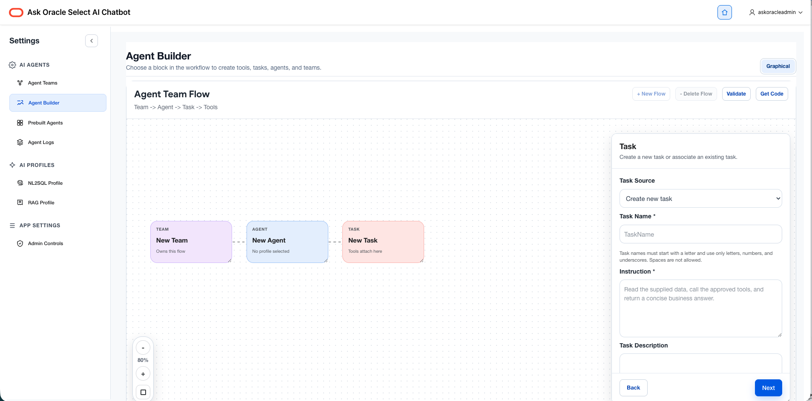
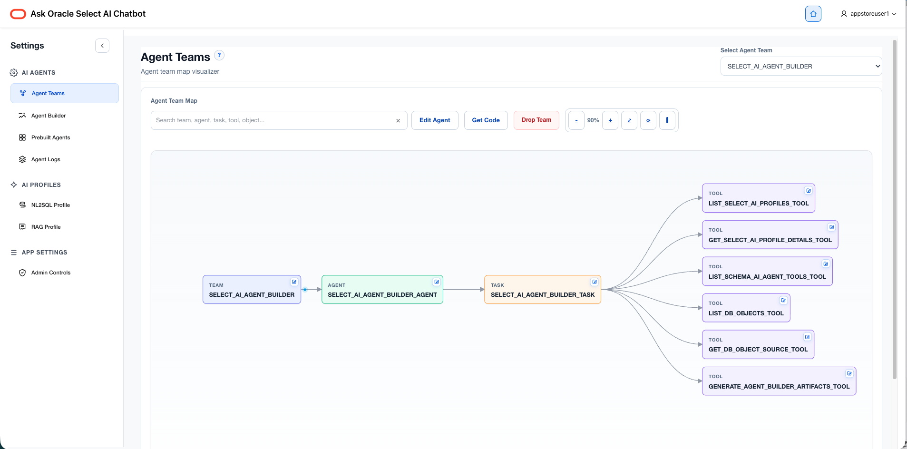
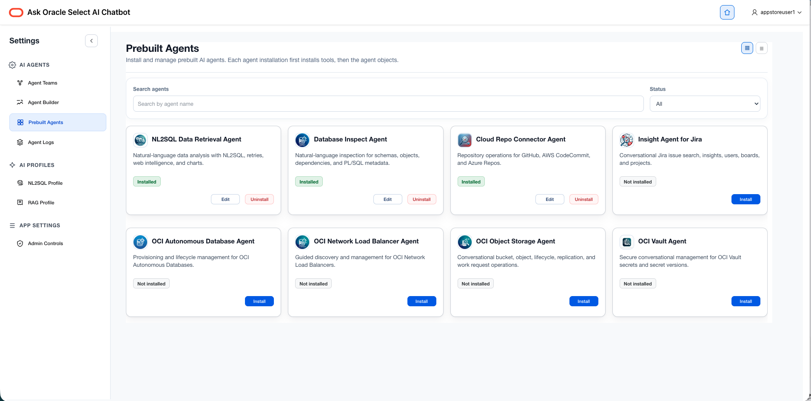
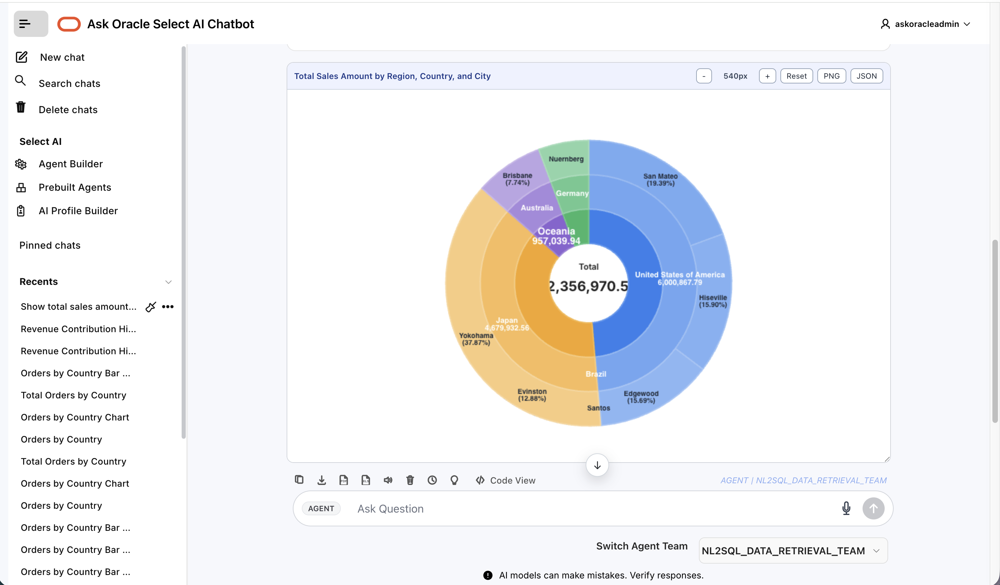
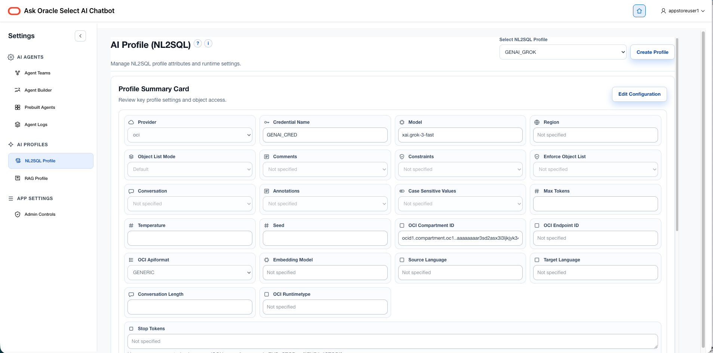
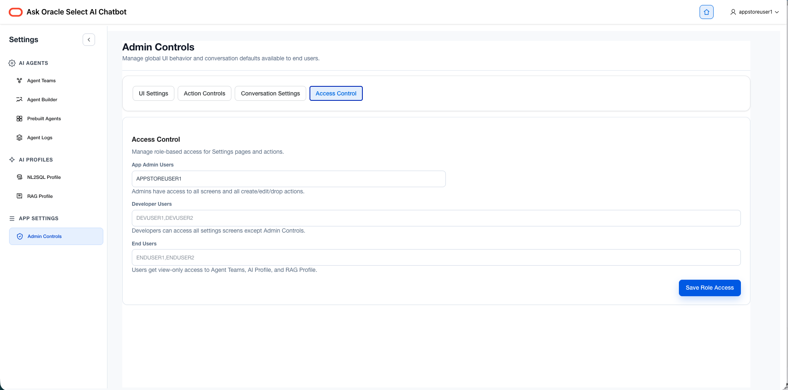

# Ask Oracle Select AI Chatbot 5.0

The **Ask Oracle Select AI Chatbot** Oracle APEX application provides a modern, low-code interface for Oracle Select AI.

Originally designed as a conversational chatbot for natural language access to Oracle AI Database, **Release 5.0** transforms Ask Oracle into a complete platform for building, configuring, governing, and deploying AI-powered applications using Oracle Select AI.

Using AI Profiles, Vector Indexes, and Oracle Select AI Agents, developers and business users can build conversational analytics, Retrieval-Augmented Generation (RAG) applications, and multi-agent workflows—all without writing application code.

Whether you're querying enterprise data with natural language, building AI agents visually, or deploying governed AI applications, Ask Oracle provides an intuitive Oracle APEX experience running directly inside **Oracle AI Database** and **Autonomous AI Database**.

---

# What's New in Release 5.0

Release 5.0 introduces major enhancements that transform Ask Oracle from a chatbot into a low-code AI application platform.

## Highlights

- 🆕 Visual Agent Builder for Oracle Select AI Agents and Agent Teams
- 🗺️ Agent Team Map for visualizing orchestration and workflows
- 🤖 One-click installation and management of prebuilt Oracle AI Agents
- 📊 Automatic chart generation from natural language
- ⚙️ Complete AI Profile lifecycle management for NL2SQL, RAG, and Agents
- 🔒 Enterprise governance with centralized administration and button-level access control
- 🎨 Improved branding, navigation, defaults, and application customization
- 🚀 Enhanced usability, performance, and overall user experience

---

# Ask Oracle Features

Release 5.0 provides a comprehensive set of Oracle Select AI capabilities.

## Conversational AI

- **Chat** — Direct interaction with the Large Language Model (LLM) configured in your AI Profile.
- **NL2SQL** — Query Oracle AI Database using natural language.
- **RAG** — Ground responses using Retrieval-Augmented Generation (RAG) with Oracle Vector Search.
- **AI Agents** — Execute Oracle Select AI Agents and Agent Teams.
- **Explain SQL** — Generate natural language explanations of generated SQL.
- **Conversation History** — Create, manage, and organize conversations with long-term memory.
- **Speech Generation** — Listen to AI responses using text-to-speech.

---

## Visual Agent Builder

Release 5.0 introduces a new **low-code Agent Builder** for Oracle Select AI.

Create and manage AI Agents visually without manually editing metadata.

Features include:

- Visual Agent Team Builder
- Natural language agent generation
- Team configuration
- Agent configuration
- Task configuration
- Tool assignment
- Agent validation
- Oracle Select AI Agent Framework code generation

> **Screenshot:** Agent Builder

---

## Agent Team Map

Visualize agent orchestration with the new **Agent Team Map**.

The Agent Team Map displays relationships between:

- Agent Teams
- Agents
- Tasks
- Tools

This graphical view makes it easy to understand workflow execution and orchestration.

> **Screenshot:** Agent Team Map

---

## Prebuilt Oracle AI Agents

Quickly get started using Oracle's collection of prebuilt Select AI Agents.

The new interface allows you to:

- Browse available agents
- Install agents with one click
- Review configurations
- Customize agents
- Extend agents using the Visual Agent Builder

> **Screenshot:** Prebuilt Agents

---

## Smarter Chart Generation

Charts are now a natural part of the conversation.

Simply ask questions like:

- *Show revenue by region as a bar chart.*
- *Compare sales by quarter.*
- *Display customer growth as a line chart.*

Release 5.0 automatically detects visualization intent and generates the most appropriate chart.

Additional enhancements include:

- Automatic chart selection for agents by analyzing prompts
- Support for sunburst chart
- Improved visualization intent detection
- Better fallback handling
- Persistent charts in conversation history

> **Screenshot:** Automatic Chart Generation

---

## AI Profile Management

Release 5.0 significantly expands AI Profile management.

Manage the complete lifecycle of profiles for:

- NL2SQL
- RAG
- AI Agents

Capabilities include:

- Create profiles
- Edit profiles
- Delete profiles
- Validate configurations
- Configure AI providers
- Configure embedding models
- Configure vector indexes
- Configure retrieval settings
- Reuse profiles across applications

> **Screenshot:** AI Profile Management

---

## Enterprise Governance

Release 5.0 introduces centralized governance and administration for enterprise AI applications.

### UI Settings

Customize your application with:

- Application name
- Logo
- Branding
- Navigation

### Conversation Settings

Configure default:

- Conversation mode
- NL2SQL Profile
- RAG Profile
- Agent Team

### Action Controls

Enable or disable features including:

- SQL Editor
- Export PDF
- Export Excel
- Delete actions
- Conversation Timer
- Agent Reasoning

### Access Control

Administrators can configure button-level permissions to tailor functionality for different users and environments.

> **Screenshot:** Admin Controls

---

# Release 5.0 Overview

Ask Oracle now supports:

| Capability | Description |
|------------|-------------|
| 💬 Chat | Direct LLM conversations |
| 🗄️ NL2SQL | Natural Language to SQL |
| 📚 RAG | Retrieval-Augmented Generation |
| 🤖 AI Agents | Oracle Select AI Agent Framework |
| 🏗️ Agent Builder | Visual low-code Agent Builder |
| 🗺️ Agent Team Map | Visual workflow orchestration |
| 📦 Prebuilt Agents | Install Oracle AI Agents |
| 📊 Charts | Automatic visualization |
| 📝 SQL Explanation | Explain generated SQL |
| 💾 Conversations | Long-term conversation history |
| 🔊 Speech | Text-to-Speech responses |
| ⚙️ AI Profiles | Complete lifecycle management |
| 🔒 Governance | Enterprise administration |
| 🎨 Branding | UI customization |
| 🔑 Access Control | Button-level permissions |

---

# Oracle APEX in Autonomous AI Database

Oracle APEX (Application Express) is Oracle's low-code development platform for building secure, scalable, and data-driven web applications.

Running directly inside Oracle AI Database and Autonomous AI Database, Ask Oracle demonstrates how Oracle APEX and Oracle Select AI work together to build enterprise AI applications with minimal code.

You can use the application as-is or customize it as the foundation for your own AI-powered solutions.

---

# Installing Ask Oracle

Since Oracle Autonomous AI Database includes Oracle APEX, installation is simple.

1. Create an Oracle APEX Workspace.
2. Import the Ask Oracle application using **App Builder**.
3. Configure your Oracle Select AI Profiles.
4. Configure your Agent Teams (optional).
5. Start asking questions.

## Installation Video

- [Install Ask Oracle Chatbot](https://youtu.be/kjeQ2AC3TFo)

## Download

- [Download the latest Ask Oracle APEX Application](https://github.com/oracle-devrel/oracle-autonomous-database-samples/blob/main/apex/Ask-Oracle/ADB-AskOracle-Chatbot-2026-06-04.sql)

---

# Resources

Learn more about Oracle Select AI and Oracle APEX.

- [Oracle Autonomous AI Database Select AI](https://www.oracle.com/autonomous-database/select-ai/)
- [Getting Started with Select AI](https://docs.oracle.com/en-us/iaas/autonomous-database-serverless/doc/select-ai-get-started.html)
- [Manage AI Profiles](https://docs.oracle.com/en-us/iaas/autonomous-database-serverless/doc/select-ai-manage-profiles.html)
- [Oracle Select AI Agent Framework](https://docs.oracle.com/en-us/iaas/autonomous-database-serverless/doc/select-ai-agent.html)
- [Oracle APEX](https://apex.oracle.com/)
- [Oracle APEX in Autonomous AI Database](https://docs.oracle.com/en/cloud/paas/autonomous-database/serverless/adbsb/application-express-autonomous-database.html)

---

## License

Copyright (c) 2026 Oracle and/or its affiliates.

Licensed under the **Universal Permissive License (UPL) Version 1.0**

https://oss.oracle.com/licenses/upl/